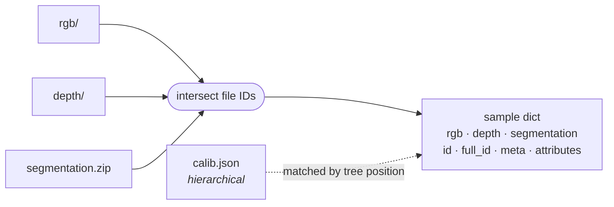

<!-- euler header — shared across the euler packages.
     Per package, change only: the <h1>, the tagline, and the badge URLs. -->
<p align="center">
  
</p>

<h1 align="center">euler-loading</h1>

<p align="center">
  <em>One PyTorch <code>Dataset</code> across arbitrarily many data modalities — matched by ID, not by filename luck.</em>
</p>

<p align="center">
  <a href="https://pypi.org/project/euler-loading/"></a>
  <a href="https://pypi.org/project/euler-loading/"></a>
  <a href="LICENSE"></a>
  <a href="https://github.com/d-rothen/euler-loading/actions/workflows/ci.yml"></a>
</p>

---

Multi-modal datasets arrive as separate directory trees — RGB here, depth there,
segmentation in a zip, calibration somewhere above it all. Keeping them in step
usually means a pile of fragile path arithmetic.

euler-loading replaces that. Each modality is indexed by
[ds-crawler](https://github.com/d-rothen/ds-crawler), and euler-loading
**intersects the file IDs** across modalities so every sample holds exactly one
file per modality. Hierarchical files such as per-scene calibration are matched
by their position in the tree and shared across the samples below them.



It never interprets file contents. It resolves *which* file to load and hands
the path — or an in-memory buffer, for zip-backed modalities — to a loader
function, which you supply or let euler-loading resolve from the dataset's
`dataset-head.json` contract.

## Install

```bash
pip install "euler-loading[gpu]"
```

Requires Python 3.9+. The `[gpu]` extra pulls in PyTorch for the tensor loaders;
without it the package still works using the CPU (NumPy) loaders.

## Quick start

```python
from euler_loading import Modality, MultiModalDataset
from euler_loading.loaders.gpu import vkitti2

dataset = MultiModalDataset(
    modalities={
        "rgb":   Modality("/data/vkitti2/rgb",   loader=vkitti2.rgb,   split="train"),
        "depth": Modality("/data/vkitti2/depth", loader=vkitti2.depth, split="train"),
    },
    hierarchical_modalities={
        "intrinsics": Modality("/data/vkitti2/textgt", loader=vkitti2.read_intrinsics),
    },
)

sample = dataset[0]
sample["rgb"]         # torch.Tensor (3, H, W) float32 in [0, 1]
sample["depth"]       # torch.Tensor (1, H, W) float32, metres
sample["intrinsics"]  # {file_id: (3, 3) tensor} for every calib file above this sample
sample["id"]          # leaf file ID, shared across modalities
sample["full_id"]     # full hierarchical path, e.g. "/Scene01/Camera_0/00000"
```

Drop it straight into a `DataLoader` — it is a standard `torch.utils.data.Dataset`:

```python
loader = DataLoader(dataset, batch_size=16, num_workers=4, pin_memory=True)
```

## Automatic loader resolution

Omit `loader=` and euler-loading resolves the loader declared by that
modality's ds-crawler dataset contract:

```python
dataset = MultiModalDataset(
    modalities={
        "rgb": Modality("/data/vkitti2/rgb", split="train"),
    },
)
```

The modality root must contain `.ds_crawler/dataset-head.json` (or the scoped
equivalent) with a named `euler_loading` entry in its `addons` object. A minimal
RGB contract looks like this:

```json
{
  "contract": {
    "kind": "dataset_head",
    "version": "1.0"
  },
  "dataset": {
    "id": "vkitti2_rgb",
    "name": "Virtual KITTI 2 RGB"
  },
  "modality": {
    "key": "rgb",
    "meta": {
      "range": [0, 255]
    }
  },
  "addons": {
    "euler_loading": {
      "version": "1.0",
      "loader": "vkitti2",
      "function": "rgb"
    }
  }
}
```

`loader` selects a built-in loader module and `function` selects the callable
inside it. Automatic resolution uses the GPU variant; pass a loader explicitly
when you want the CPU variant or a custom callable. See
[Automatic loader resolution](docs/loaders.md#automatic-loader-resolution) for
the full contract and writer rules.

## What you get

| | |
|---|---|
| **ID intersection** | Every sample has exactly one file per modality. Unmatched files are reported, not silently dropped. |
| **Hierarchical modalities** | Per-scene or per-sequence calibration is matched by tree position and cached, with deepest-file-wins inheritance. |
| **Zip-native** | Point a modality at a `.zip` and files are read from the archive without extraction. One handle per worker. |
| **Splits** | `Modality(path, split="train")` overlays a ds-crawler inline split on the canonical index. |
| **Scoped metadata** | Several logical modalities can share one physical root or archive via `metadata_scope`. |
| **Loader resolution** | Loaders and writers resolve from the `dataset-head.json` `addons.euler_loading` contract, so datasets describe how to read themselves. |
| **Writing back** | Resolved writers put inference outputs back in dataset-native formats, re-indexable with matching IDs. |
| **Spatial preprocessing** | `SamplePreprocessor` resizes and crops consistently across images, depth, masks, ray maps *and* intrinsics. |

## Built-in loaders

Every dataset module exists in two variants: `loaders.gpu.*` returns
`torch.Tensor` in CHW layout, `loaders.cpu.*` returns `numpy.ndarray` in HWC.
All of them accept both filesystem paths and in-memory buffers.

| Module | Dataset | Modalities |
|---|---|---|
| `vkitti2` | Virtual KITTI 2 | rgb, depth, class/instance segmentation, scene flow, sky mask, intrinsics, extrinsics |
| `muses` | MUSES | rgb, reference rgb, semantic & panoptic segmentation, sky mask, lidar point cloud, sparse depth, calibration |
| `real_drive_sim` | Real Drive Sim | rgb, depth, class segmentation, sky mask, calibration, intrinsics, extrinsics |
| `princeton_dense` | Princeton DENSE / SeeingThroughFog | rgb, rccb, sparse depth, intrinsics, extrinsics |
| `generic_dense_depth` | *any* — inferred from file extension | rgb, depth, sky mask, intrinsics |
| `generic` | *any* — `.npy` / `.npz` modalities | points 3d, maps, segmentation, spherical maps, SH coefficients, … |

Full inventory with shapes, dtypes and units: [docs/loaders.md](docs/loaders.md).
The machine-readable version is
[`loaders.json`](euler_loading/loaders/generate/loaders.json).

## Documentation

| Guide | Covers |
|---|---|
| [Dataset & modalities](docs/dataset.md) | `Modality` and `MultiModalDataset` reference, the sample dict, splits, scoped metadata, zip archives, layout-aware loading |
| [Loaders & writers](docs/loaders.md) | The loader contract, automatic resolution, per-file attributes, the full built-in inventory |
| [Preprocessing & transforms](docs/preprocessing.md) | Cross-modal transforms, `SamplePreprocessor`, calibration-aware resize and crop |
| [Writing outputs](docs/writing.md) | Writing predictions back in dataset-native formats and re-indexing them |
| [Examples](examples/) | Runnable scripts against real datasets |

## Development

```bash
git clone https://github.com/d-rothen/euler-loading.git
cd euler-loading
pip install -e ".[gpu,dev]"
pytest
```

See [CONTRIBUTING.md](CONTRIBUTING.md) for the loader-authoring workflow and
release process.

## License

[MIT](LICENSE) © Daniel Rothenpieler
